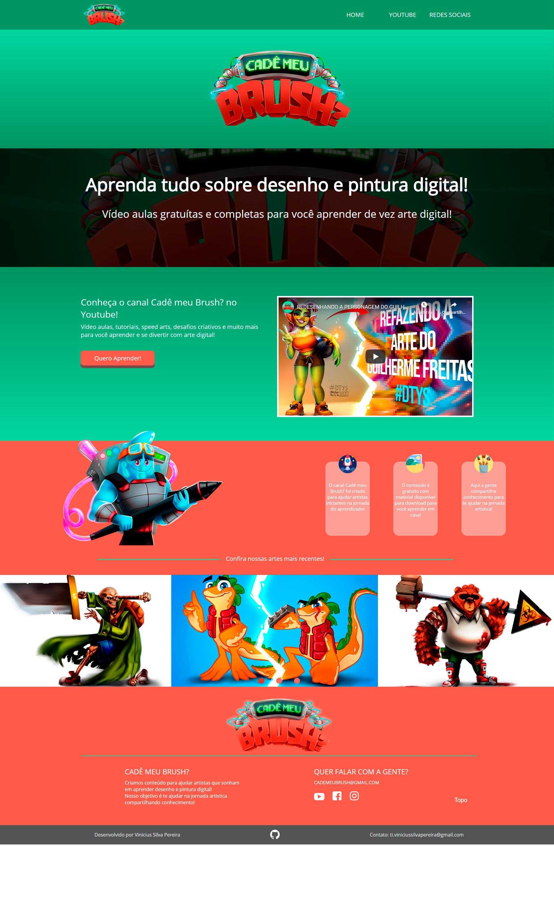
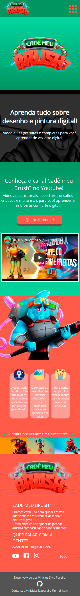
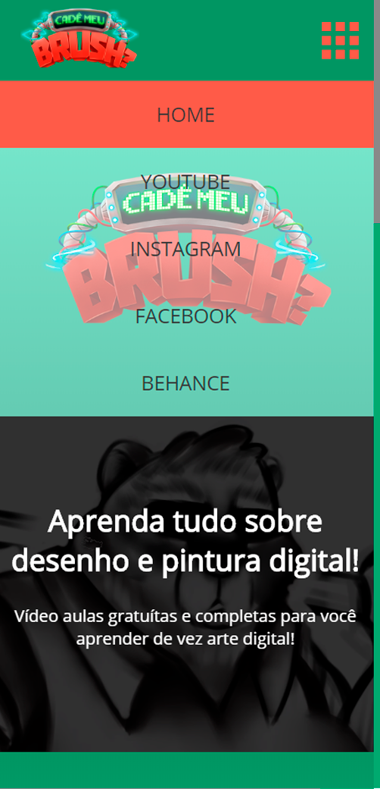

# Cadê meu Brush? 

## Objetivo do Projeto 
Desenvolver uma página para o canal de arte e criatividade "Cadê meu Brush?". Através do site o usuário tem acesso a todas as redes sociais, vídeos, botão de redirecionamento e um slider com artes recentes.

## Desktop Viewport 
Tela responsiva que se adapta de acordo com o viewport. Foram aplicados conceitos de Display Grid, Display Flex, utilização de Pseudo Classes. Na pagina principal vemos um video que usa a propriedade auto play em loop e mutado. Quando passamos o mouse por cima a opacidade da classe overlay aumenta e vemos o video com mais clareza. Os botoes e links redirecionam para novas guias, para manter a pagina aberta para o usuario. 
O logotipo foi animado usando a propriedade Animate do CSS3, e as animações foram feitas frame a frame no photoshop e exportadas em imagem com transparencia, no código temos 10 quadros que utilizam a propriedade alternate, que quando chega à 100% da animação ela reproduz de forma reversa, então a animação fica em looping e nunca quebra, dando sensação de continuidade. 
 

## Mobile Viewport 
O mobile viewport se adapta automaticamente de acordo com a tela, mantendo o aspecto dos items e adaptando as divs que estão com display flex e grid, mantendo-as alinhadas. 
 

## Mobile Menu 
Quando clicar no icone de menu uma animação via Jquery chama o menu mobile com slideToggle, que faz o menu aparecer deslizando de cima para baixo. 
 

